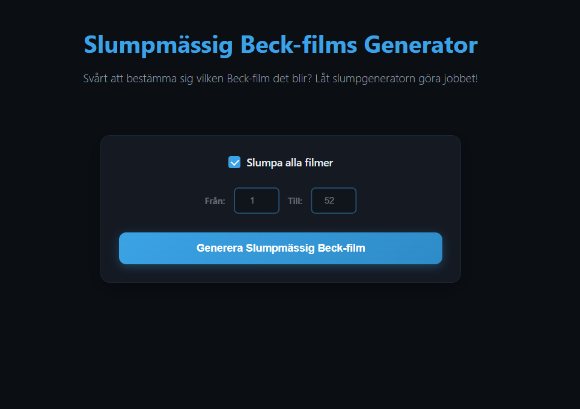

# :cop: :clapper: Random Beck Movie Generator

[](https://sonarcloud.io/summary/overall?id=bellmano_randombeck.se)
[](https://sonarcloud.io/summary/overall?id=bellmano_randombeck.se)
[](https://sonarcloud.io/summary/overall?id=bellmano_randombeck.se)
[](https://sonarcloud.io/summary/overall?id=bellmano_randombeck.se)
[](https://sonarcloud.io/summary/overall?id=bellmano_randombeck.se)
[](https://sonarcloud.io/summary/overall?id=bellmano_randombeck.se)
[](https://sonarcloud.io/summary/overall?id=bellmano_randombeck.se)

A website that helps you choose a random Beck movie to watch. Perfect for when you can't decide which Beck film to enjoy!

## :test_tube: Running Tests

To run the tests and view coverage:

1. Install the required dev dependency:
	```powershell
	npm install
	```
2. Run the test coverage script:
	```powershell
	npm run test:coverage
	```

This will execute the tests and generate a coverage report.

## :gem: Website
<a href="https://randombeck.se/"></a>

## :heart: Acknowledgments

- Movie data and posters from TMDB and IMDb
- Streaming links courtesy of TV4 Play

## :mega: Issues or Suggestions
Any issues or suggestions, please [create an issue on Github](https://github.com/bellmano/randombeck.se/issues).

## :coffee: Buy me a coffee
Donations are welcome to appreciate my work to keep this website alive, but isn't required at all.

<!-- PayPal icon/button is used from this GitHub repo: https://github.com/andreostrovsky/donate-with-paypal -->
<a href="https://www.paypal.me/bellmano1"></a>